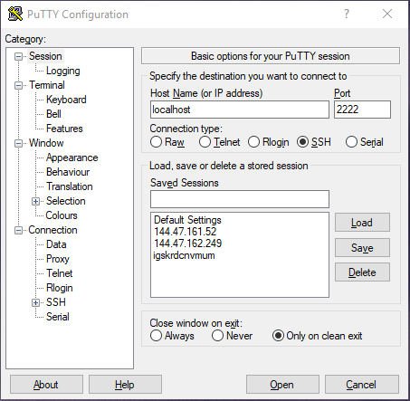
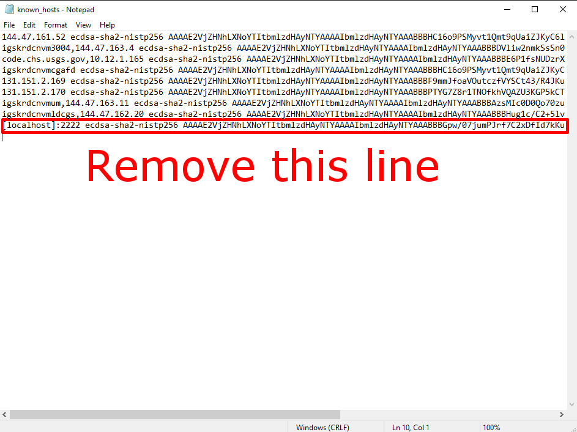

# Introduction
MapKB is a collection of geospatial data compiled from the USGS and presented using Semantic standards.
# Quick Start
1.  Install Docker or Docker Desktop on your computer.
    - If you are running Windows also install WSL and your favorite Linux distribution.  WSL 2 is recommended.  Docker Desktop will need to be configured for WSL integration.
    - If docker-compose is not provided with your Docker installation you will need to install it as well.
2.  From within your favorite terminal application go to the folder to which you cloned this repository and run `./deploy.sh`
    - Windows users will need to do this from within a WSL terminal.
3.  In your favorite web browser go to http://localhost
# Reinstalling MapKB
* In your favorite terminal go to the folder where you cloned this repository and type `docker-compose down`
* Run `./deploy.sh` again.
# Advanced Installation Options
MapKB offers several different installation options.
# Technical Details
# Accessing Graph Data
<!-->
1.  Create a support ticket with the IT Service Desk to install Docker if it is not already installed on your computer.
2.  Clone this repository. __Do not change the folder name.  It must be stay makb-docker-container, otherwise it will break Docker__
3.  Copy the jar folder from `N:\CEGIS\Jacques\makb_container` to `./makb-tomcat/Dockerbuild`  

4.  Start Docker Desktop if it is not already running.
5.  Open a powershell (or bash if on WSL or Linux) prompt and change directory to the location where you cloned your repository.
6.  Type `docker-compose up` to build the images required to host MAKB.  This will take a long time and you will see several pages of messages looking like this:

7.  Eventually you will a line of text that says `tomcat_1      | 26-Dec-2019 19:15:37.552 INFO [main] org.apache.catalina.startup.Catalina.start Server startup in [27,679] milliseconds`  The number of milliseconds will vary depending on the speed of your computer. 
 
8.  Congratulations, the MAKB containers have been built.
9.  In the powershell window press CTRL+C to stop the MAKB containers.
# How to start and stop the MAKB containers
If Docker Desktop isn't running, start it.
Open a powershell terminal, (again bash can be used interchangably here) and change directory to the root of your cloned repository.  
Type `docker-compose start` to start the MAKB containers.  
When you are done for the day, type `docker-compose stop` to shutdown the container.   
__There is another command `docker-compose down`, this will destroy the containers and will not give you an opportunity to confirm, use extreme caution before running this command__
# Configuring GeoServer
The Docker entrypoint script uses REST to import the shape files and namespaces for USGS into GeoServer.  Unfortunately I haven't figured out how to automatically publish the layers. Luckily, process is pretty straight forward.
1.  Navigate to [http://localhost:8080/geoserver](http://localhost:8080/geoserver)
2.  Login as __admin__ with password __geoserver__  
 
3.  Click the Add layers button  
 
4.  Select __usgsns:usgs_prototype_geonames__ in the dropdown  

5.  Click the Publish link  

6.  Under __Bounding Boxes__ heading click "Compute from data" and "Compute from native bounds"  

7.  Click the save button.
8.  Click Add a new Layer and repeat steps 3 through 7 for __usgsns:usgs_prototype_gnis__ and __usgsns:usgs_prototype_structures__
# So what do I do with this?
My original goal was to create a sort of shared folder between the tomcat container and the local workstation (a volume in docker terminology). Unfortunately the firewall rules within the organization prevented me from doing so.  Instead I installed SSH in the tomcat container.  
To access the container via SSH, simply point your preferred SSH client at _localhost_ port _2222_.  
If you are using the Windows (or Linux) SSH client the command is as follows:  
`ssh root@localhost -p 2222`  
If you are using PuTTY the PuTTY configuration is as follows:  
  
If you are prompted for a username, the username is __root__ the password to log in is __toor__
## What this means at a minimum
At a minimum this allows you to do all your development as you've always done.  The Tomcat container is built on Debian Stretch (9.0).  This means Git is installed and APT is available, so if you want to spin up an environment you can install whatever command line tools you prefer (Vim, Emacs, Nano, et al).  Alternatively, if you prefer to write code in Notepad++ and SCP it to the server, you can simply SCP it to the container using the credentials provided above.  What is different, is if you somehow nuke this container, you can revert it back to a known state by calling `docker-compose down` from the repository folder, and then calling `docker-compose up`.  The tomcat install is located at `/usr/local/tomcat` and the webapps folder is located at `/usr/local/tomcat/webapps`.  The tomcat server is located at [http://localhost:8080](http://localhost:8080).  The apps manager username and password are __tomcat__ and __s3cret__ respectively.
## A nice workflow using Visual Studio Code
Visual Studio Code has the ability to interact with a remote file system over SSH as if it was working from your local workstation.  We can exploit this to create a very nice workflow for our MAKB containers.
1.  Download [Visual Studio Code.](https://code.visualstudio.com/)
2.  Click on the Extensions Pane and install the Remote - SSH extension provided by Microsoft by clicking the green install button.  If the extension cannot be found simply type "SSH" into the search box:  
  
3.  After installing the install button will change to a gear icon:   
4.  Find the green arrows at the bottom left corner of the windows and click them.  
  
The icon appears as follows:   
5.  In the resulting popup dialog select Remote-SSH: Connect to Host..., ignoring any other options.  
  
6.  Select Add New SSH Host..., ignoring any other options  
  
7.  Type `ssh root@localhost -p 2222` in the dialog box and press Enter  
  
8.  Select the top config file and press enter.
__If the top config file gives you errors, the bottom config file C:\ProgramData\ssh\ssh\_config works as well__
  
9.  Upon completion, the following dialog box will show up in the lower right corner of the window:  
  
10. Click the green arrows in the lower left hand corner again.   
11. In the resulting popup dialog select Remote-SSH: Connect to Host..., ignoring any other options.  
  
12. Select localhost and press Enter  
  
13. Visual Studio Code will open a new window and ask you to accept the SHA fingerprint, click Continue.  
  
14. Enter the password, in this case __toor__ and press enter.  
  
15. Visual Studio Code is now configured to allow you to do development in your container. You can `cd /usr/local/tomcat/webapps` and clone MAKB directly to the webapps folder on the container.
## Connecting your container to GitLab
These instructions assume you've already configured Visual Studio Code to connect your container.  
1.  Start your docker instances if you haven't already done so and connect Visual Studio Code.
2.  Open a new terminal by Clicking `Terminal > New Terminal`
3.  In the new terminal pane type `ssh-keygen` and press Enter
4.  Continue pressing enter until the command completes.
5.  Click `File > Open file` and navigate to /root/.ssh/id_rsa.pub
6.  Copy the text to the clipboard.
7.  Using your favorite web browser, navigate to [https://code.chs.usgs.gov/groups/cegis](https://code.chs.usgs.gov/groups/cegis) and log in with your AD credentials.
8.  Click the Avatar in the upright hand corner of the browser view port and select Settings.
9.  On the left hand side select 'SSH Keys'
10. In the Key field paste the text you copied from Visual Studio Code.
11. In the title field give the key is nice name, like MAKB Docker Container.
12. Click Add key
13. Close the browser window. You are done with it.
14. If the id_rsa.pub file is still open in Visual Studio Code, close it.
15. Open a new terminal pane if one is not already open.
16. Type `cd /usr/local/tomcat/webapps` and press Enter
17. Type `git clone git@code.chs.usgs.gov:cegis/makb.git` and press Enter
18. If you are prompted to continue connecting say yes
19. Click `File > Open Folder`
20. Navigate to `/usr/local/tomcat/webapps/makb` or simply paste it in the dialog box and press Enter.  
21. Enter your container password (__toor__) when prompted to do so.  
22. Congratulations, you can now interact with with your container filesystem and MAKB Git repository through Visual Studio Code.

# I've screwed up my development environment, now what?
If you should find yourself in a situation where you've done something that leaves your containers in an unworkable state (or it's just too time consuming to fix), simply issue the command `docker-compose down` followed by the command `docker-compose up` from the root of your cloned repository as indicated by the screenshot below:  
  
__IF YOU ARE DOING ANY DEVELOPMENT INSIDE YOUR CONTAINER MAKE SURE YOU COMMIT AND PUSH ANY CHANGES YOU WISH TO KEEP BEFORE DOING THIS AS THE CONTENTS OF THE CONTAINER WILL BE REVERTED TO THE DEFAULT STATE__  
Any authenication tokens will also be destroyed as well, such as GitLab.  You will need to remove the public key for localhost from `%HOMEPATH%\.ssh\known_hosts`:  
  
-->

